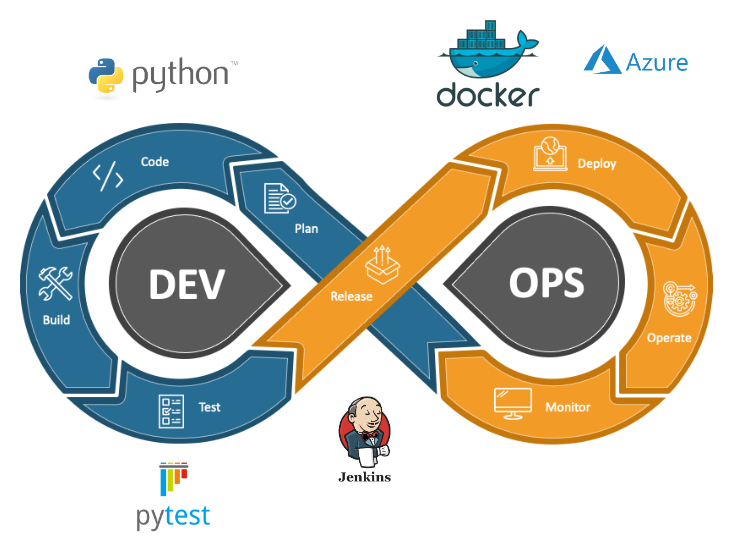

# Expense Splitter 
Expense Splitter is a web application designed to simplify the process of dividing the expenses among a group of people. It's a convenient tool for tracking and settling shared expenses, making it ideal for group activities such as dinners, road trips, or any situation where expenses need to be divided equally.

## Features

- **Intuitive Interface**: Easily input expenses, participants, and amounts with a user-friendly interface.
- **Equal Splitting**: Automatically calculates and displays each participant's share of expenses.

## Getting Started

To be able to run the application, you need to have Docker installed on your machine.

1. **Pull the repository from DockerHub:**\
docker pull tobbeee/expense_splitter:latest

3. **Run the Docker container:**\
docker run -p 80:80 tobbeee/expense_splitter

5. **Access the Application:**\
Open your web browser and access the application at: <your_ip>

## Usage
1. **Add participants**:
Begin by adding participants that will share the expenses. 
2. **Add expenses**:
Start adding expenses to the group. Enter the expense details such as description, amount, payer, and the participants who shared the expense.
3. **Split expenses**:
The application automatically calculates each participant's share based on the expensenes entered.

## License
This project is licensed under the [MIT License](LICENSE).

## Intended pipeline used for this submssion

In this release, the deployment to azure server did not work as intended. This will be updated in the next release, which will make it possible to run the application in the web browser, without having to set up a Docker container!
